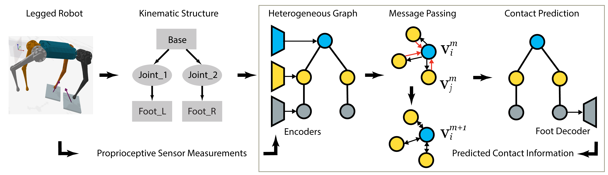
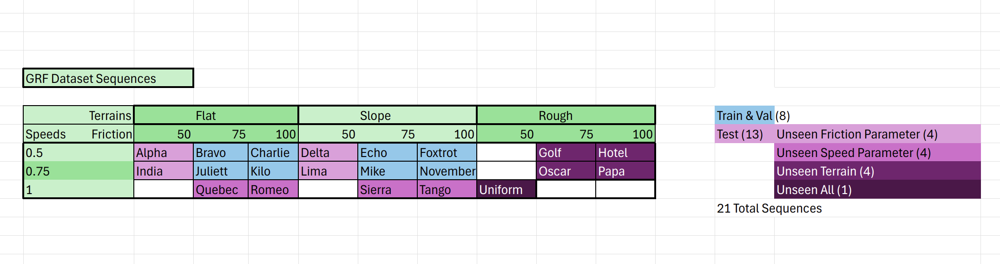
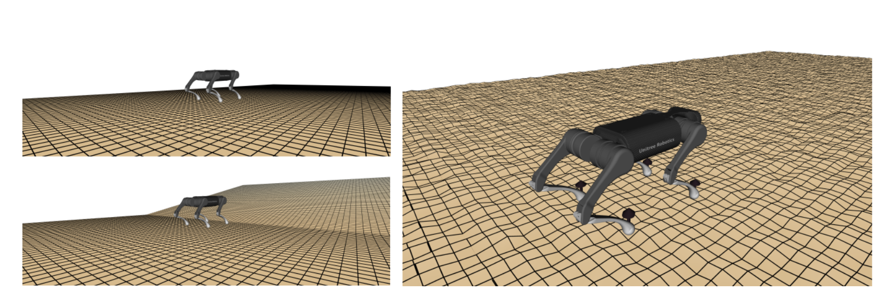

# MI-HGNN for contact estimation/classification
This repository implements a Morphology-Inspired Heterogeneous Graph Neural Network (MI-HGNN) for estimating contact information on the feet of a quadruped robot. For more details, see our publication "[MI-HGNN: Morphology-Informed Heterogeneous Graph Neural Network for Legged Robot Contact Perception](https://arxiv.org/abs/2409.11146)".



## Setup
---

### Installation
To get started, setup a Conda Python environment with Python=3.11:
```
conda create -n mi-hgnn python=3.11
conda activate mi-hgnn
```

Then, install the library (and dependencies) with the following command:
```
pip install .
```

Note, if you have any issues with setup, refer to `environment_files/README.md` so you can install the exact libraries we used.

### URDF Download
The necessary URDF files are part of git submodules in this repository, so run the following commands to download them:
```
git submodule init
git submodule update
```

## Usage
---

### Replicating Paper Experiments

We provide code for replicating the exact experiments in our paper and provide full model weights for every model referenced in our paper. See `paper/README.md` for more information.


### Applying to your Robot/Dataset

Although our paper's scope was limited to application of MI-HGNN on quadruped robots for contact perception, it can easily be applied to other multi-body dynamical systems and on other tasks/datasets, following the steps below:

1. Add new URDF files for your robots by following the instructions in `urdf_files/README.md`. 
2. Incorporate your custom dataset using our `FlexibleDataset` class and starter `CustomDatasetTemplate.py` file by following the instructions at `src/mi_hgnn/datasets_py/README.md`.
3. After making your changes, rebuild the library following the instructions in [#Installation](#installation). To make sure that your changes haven't
broken critical functionality, run the test cases with the command `python -m unittest discover tests/ -v`.
4. Using the files in the `research` directory as an example, call our `train_model` and `evaluate_model` functions provided in `src/mi_hgnn/lightning_py/gnnLightning.py` with defined train, validation, and test sequences. 

We've designed the library to be easily applicable to a variety of datasets and robots, and have provided a variety of customization options in training, dataset creation, and logging. We're excited to see everything you can do with the MI-HGNN!

### Simulated A1 Dataset

To evaluate the performance of our model on GRF estimation, we generated our own simulated GRF dataset, which we now contribute to the community as well. We recorded proprioceptive sensor data and the corresponding ground truth GRFs by operating an A1 robot in the [Quad-SDK](https://github.com/lunarlab-gatech/quad_sdk_fork) simulator. In total, our dataset comprises of 530,779 synchronized data samples with a variety of frictions, terrains, and speeds. All of the different sequences are outlined in the table below:



A visualization of the various data collection environments can be seen below.



If you'd like to use this dataset, the recorded sequences can be found on [Dropbox](https://www.dropbox.com/scl/fo/4iz1oobx71qoceu2jenie/AJPggD4yIAFXf5508wBz-hY?rlkey=4miys9ap0iaozgdelntms8lxb&st=0oz7kgyq&dl=0). See `paper/README.md` and Section V-B of our publication for specific details on this dataset and how to use it.

## Other Info
---
### Contributing

We encourage you to extend the library for your own applications. If you'd like to contribute to the repository, write sufficient and necessary test cases for your additions in the `tests` directory, and then open a pull request. Reach out to us if you have any questions.

### Citation

If you find our repository or our work useful, please cite the relevant publication:

```
@article{butterfield2024mi,
  title={{MI-HGNN: Morphology-Informed Heterogeneous Graph Neural Network for Legged Robot Contact Perception}},
  author={Butterfield, Daniel and Garimella, Sandilya Sai and Cheng, Nai-Jen and Gan, Lu},
  journal={arXiv preprint arXiv:2409.11146},
  year={2024},
  eprint={2409.11146},
  url={https://arxiv.org/abs/2409.11146},
}
```

### Contact / Issues

For any issues with this repository, feel free to open an issue on GitHub. For other inquiries, please contact Daniel Butterfield (dbutterfield3@gatech.edu) or the Lunar Lab (https://sites.gatech.edu/lunarlab/).