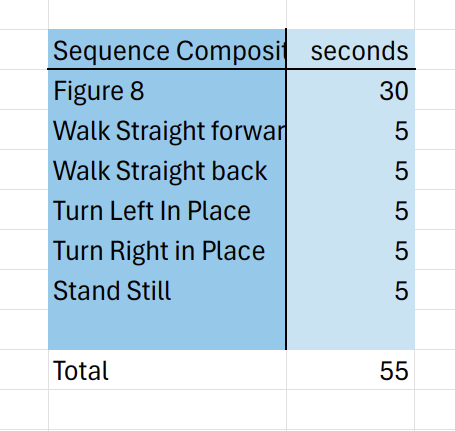

# Paper Replication

This directory provides information on replicating experiments in the [MI-HGNN: Morphology-Informed Heterogenous Grpah Neural Network for Legged Robot Contact Perception](https://arxiv.org/abs/2409.11146) paper. It includes model weights, links to other necessary repositories, and instructions for generating figures.

Whenever a specific trained model is referenced in this README (for example, `ancient-salad-5`), it will be highlighted as shown, and there will be a folder on Georgia Tech's [Dropbox](https://www.dropbox.com/scl/fo/8p165xcfbdfwlcr3jx7tb/ABoxs5BOEXsQnJgFXF_Mjcc?rlkey=znrs7oyu29qsswpd3a5r55zk8&st=53v30ys3&dl=0) with its name. Unless otherwise specified, the model weights used for the paper were those trained the longest (have highest `epoch=` number in their .ckpt file).

## Contact Detection (Classification) Experiment

For training and evaluating models on this classification task, use the `train_classification.py` and `evaluator_classification.py` files found in the `research` directory of this repository.

Our MI-HGNN models trained during this experiment can be found in the table below. For more details, see the `contact_experiment.csv` file in this directory. 

| Number of Layers | Hidden Sizes | Seed | State Accuracy (Test) | Model Name              |
| ---------------- | ------------ | ---- |---------------------- | ----------------------- |
| 8                | 128          |    0 | 0.874120593070984     | `gentle-morning-4`      |
| 8                | 128          |    1 | 0.895811080932617     | `leafy-totem-5`         |
| 8                | 128          |    2 | 0.868574500083923     | `different-oath-6`      |
| 8                | 128          |    3 | 0.878039181232452     | `hopeful-mountain-7`    |
| 8                | 128          |    4 | 0.855807065963745     | `revived-durian-8`      |
| 8                | 128          |    5 | 0.875732064247131     | `robust-planet-9`       |
| 8                | 128          |    6 | 0.883218884468079     | `super-microwave-10`    |
| 8                | 128          |    7 | 0.880922436714172     | `valiant-dawn-11`       |

The baseline models we compared to (ECNN, CNN-aug, CNN) were trained on this release: [MorphoSymm-Replication - Contact Detection](https://github.com/lunarlab-gatech/MorphoSymm-Replication/releases/tag/RepFigure3(a)). See that repository for information on accessing those model weights and generating Figure 3 (a).

### Sample Efficiency Evaluation

For training models for the sample efficiency experiment, use the `train_classification_sample_eff.py` file.

Our MI-HGNN models trained for the sample efficiency figure can be found below. For more details, see the `contact_experiment_sample_eff.csv` file in this directory.

| Training Percentage (%) | Model Name              |
| ----------------------- | ----------------------- |
|                  0.025  | `twilight-pond-9`       |
|                  0.05   | `iconic-serenity-7`     |
|                  0.1    | `daily-pine-6`          |
|                  0.15   | `dry-wood-8`            |
|                  0.2125 | `efficient-shadow-3`    |
|                  0.425  | `smart-waterfall-2`     |
|                  0.6375 | `treasured-moon-4`      |
|                  0.85   | `atomic-waterfall-5`    |

The baseline models we compared to (ECNN, CNN-aug, CNN) were trained on this release: [MorphoSymm-Replication - Contact Detection Sample Efficiency](https://github.com/lunarlab-gatech/MorphoSymm-Replication/releases/tag/RepFigure3(b)). See that repository for information on accessing those model weights and generating Figure 3 (b).

### Abalation Study

We conducted an abalation study to see how the model parameters affected performance, as shown in Table II in the paper. Here those values are associated with the model's name in the table below. For more details, including test accuracies, see the `contact_experiment_ablation.csv` file in this directory.

| Number of Layers | Hidden Sizes | Model Name             |
| ---------------- | ------------ | ---------------------- |
| 4                | 5            | `prime-water-16`       |
| 4                | 10           | `driven-shape-17`      |
| 4                | 25           | `autumn-terrain-18`    |
| 4                | 50           | `comfy-dawn-19`        |
| 4                | 128          | `prime-butterfly-20`   |
| 4                | 256          | `youthful-galaxy-21`   |
| 8                | 50           | `exalted-mountain-22`  |
| 8                | 128          | `serene-armadillo-23`  |
| 8                | 256          | `playful-durian-12`    |
| 12               | 50           | `twilight-armadillo-15`|
| 12               | 128          | `sparkling-music-14`   |
| 12               | 256          | `stoic-mountain-13`    |


## Ground Reaction Force Estimation (Regression) Experiment 

For training and evaluating models on this regression task, use the `train_regression.py` and `evaluator_regression.py` files found in the `research` directory of this repository. Note that for the floating base dynamics (FBD) model, there is no training involved, and the `evaluator_regression_dynamics.py` file should be used instead.

All of the models trained for this experiment can be found in the table below:

| Model Type | Model Name              |
| ---------- | ----------------------- |
|        MLP | `clear-haze-11`         |
|        MLP | `cosmic-water-19`       |
|        MLP | `dauntless-surf-15`     |
|        MLP | `fast-hill-18`          |
|        MLP | `gentle-thunder-16`     |
|        MLP | `icy-gorge-12`          |
|        MLP | `noble-dust-14`         |
|        MLP | `restful-meadow-13`     |
|    MI-HGNN | `amber-waterfall-25`    |
|    MI-HGNN | `faithful-elevator-27`  |
|    MI-HGNN | `feasible-valley-22`    |
|    MI-HGNN | `hopeful-rain-21`       |
|    MI-HGNN | `rare-sun-17`           |
|    MI-HGNN | `smooth-galaxy-20`      |
|    MI-HGNN | `twilight-bush-24`      |
|    MI-HGNN | `wise-firebrand-23`     |

After running the evaluation files, the data used to generate Table III can be found in the generated .csv files. Our generated .csv files are stored in this directory, and are named as follows:

- `regression_results_dynamics.csv`
- `regression_results_hgnns.csv`
- `regression_results_mlps.csv`

For the standard deviation, we calculated the "corrected sample standard deviation". For more details, see [LibreOffice Documentation](https://wiki.documentfoundation.org/Documentation/Calc_Functions/STDEV.S).

Finally, Figure 5 is generated by running the `create_regression_plots.py` file, and is saved as `regression_evaluation.png`. The visualization of Figure 5 and Pinocchio visualization used in the MI-HGNN ICRA submission video is created by running `create_regression_plot_video.py`.

### GRF Quad-SDK Dataset

For this experiment, we generated a dataset using Quad-SDK and Gazebo. The dataset consists of synchronized proprioceptive sensor measurements for a simulated A1 robot at a maximum of 500 Hz, including joint angle, joint angular velocity, and joint torque from 12 joint encoders, base linear acceleration, base angular velocity from IMU, and GRFs for each leg in Z direction. It also includes the ground truth robot pose, represented as a translation and a quaternion. 

We generated a total of 21 sequences. The following table relates the dataset sequence name (in code) to the corresponding parameters used for that sequence:


In each sequence, the operator loosely followed the high-level control instructions and timings seen below:



The dataset files can be found on [Dropbox](https://www.dropbox.com/scl/fo/4iz1oobx71qoceu2jenie/AJPggD4yIAFXf5508wBz-hY?rlkey=4miys9ap0iaozgdelntms8lxb&st=0oz7kgyq&dl=0), and the code that we used to generate this dataset can be found here: [quad-sdk-fork](https://github.com/lunarlab-gatech/quad_sdk_fork). To find the file corresponding to a sequence in the table above, notice that the files are named with the following convention below:

```
robot_1_a1_<speed>_<terrain>_<friction>_trial1_<date>.bag
```

Also, the file at `src/mi_hgnn/datasets_py/quadSDKDataset.py` also contains sequence name to file mappings.

